# 🏗️ Système de Gestion d'État Global - Praxis

## 🎯 Vue d'ensemble

Ce système fournit une gestion d'état globale et fluide pour toute l'application Praxis, éliminant le besoin de rafraîchir les pages manuellement. Toutes les données sont synchronisées automatiquement entre les composants.

## 🏛️ Architecture

### Contextes Disponibles

1. **Étudiants** (`StudentContext`)
2. **Enseignants** (`TeacherContext`)
3. **Matières** (`SubjectContext`)
4. **Classes** (`ClasseContext`)
5. **Sessions** (`SessionContext`)
6. **Résultats** (`ResultContext`)
7. **Quiz** (`QuizContext`) - spécifique aux enseignants

### Structure Générique

Tous les contextes utilisent une architecture générique qui fournit :

```typescript
interface EntityContextType<T> {
  entities: T[];                    // Liste des entités
  loading: boolean;                 // État de chargement
  error: string | null;            // Erreur éventuelle
  refreshEntities: () => Promise<void>;  // Rafraîchir les données
  addEntity: (entity: T) => void;       // Ajouter une entité
  updateEntity: (id: number, updatedEntity: Partial<T>) => void; // Modifier
  removeEntity: (id: number) => void;   // Supprimer
  getEntity: (id: number) => T | undefined; // Récupérer par ID
  setEntities: (entities: T[]) => void;     // Définir toute la liste
}
```

## 🚀 Utilisation

### 1. Hooks Disponibles

```typescript
// Hook combiné pour toutes les données
import { useAppData, useRefreshAllData } from '@/contexts/hooks';

const MyComponent = () => {
  const { students, teachers, subjects, classes, sessions, results } = useAppData();
  const refreshAll = useRefreshAllData();

  // Rafraîchir toutes les données
  const handleRefresh = () => refreshAll();

  return (
    <div>
      <p>Étudiants: {students.entities.length}</p>
      <p>Enseignants: {teachers.entities.length}</p>
      {/* ... */}
    </div>
  );
};
```

### 2. Hooks Spécifiques

```typescript
// Pour les étudiants uniquement
import { useStudentContext } from '@/contexts/entities-context';

const StudentList = () => {
  const { entities: students, loading, error, refreshEntities, addEntity } = useStudentContext();

  useEffect(() => {
    refreshEntities(); // Charger les étudiants
  }, []);

  const handleAddStudent = (student) => {
    addEntity(student); // Ajout optimiste immédiat
  };

  return (
    <div>
      {loading && <p>Chargement...</p>}
      {error && <p className="text-red-500">{error}</p>}
      {students.map(student => (
        <div key={student.id}>{student.user?.name}</div>
      ))}
    </div>
  );
};
```

### 3. Pour les Quiz (enseignants)

```typescript
import { useQuizContext } from '@/app/(features)/teachers-dashboard/_contexts/quiz-context';

const QuizManager = () => {
  const { entities: quizzes, addQuiz, updateQuiz, removeQuiz } = useQuizContext();

  const handleCreateQuiz = async (quizData) => {
    try {
      const newQuiz = await QuizzesService.create(quizData);
      addQuiz(newQuiz); // Ajout immédiat à l'interface
    } catch (error) {
    }
  };

  return (
    <div>
      {quizzes.map(quiz => (
        <div key={quiz.id}>{quiz.title}</div>
      ))}
    </div>
  );
};
```

## 🔄 Flux de Données

### Création d'une Entité

```mermaid
graph TD
    A[Utilisateur clique] --> B[Appel API]
    B --> C[API réussie]
    C --> D[Ajout optimiste au contexte]
    D --> E[Interface mise à jour immédiatement]
    B --> F[API échoue]
    F --> G[Affichage erreur]
```



### Avantages

- ✅ **Interface fluide** : Pas de rechargement de page
- ✅ **Performance** : Données mises en cache
- ✅ **Synchronisation** : État cohérent partout
- ✅ **Optimiste** : Actions immédiates, rollback si erreur
- ✅ **Réutilisable** : Architecture générique

## 🛠️ Extension

### Ajouter un Nouveau Contexte

1. **Définir les types** dans le fichier approprié
2. **Créer le service** avec les méthodes CRUD
3. **Utiliser `createEntityContext`**

```typescript
// Exemple pour un nouveau contexte "Cours"
export interface Course {
  id: number;
  title: string;
  description: string;
  teacher_id: number;
  subject_id: number;
}

const CourseService = {
  async getAll() { /* ... */ }
};

const { EntityProvider: CourseProvider, useEntityContext: useCourseContext } =
  createEntityContext<Course>('Course', CourseService);
```

## 📋 Bonnes Pratiques

### ✅ À Faire

- Utiliser `addEntity` après création API réussie
- Appeler `refreshEntities` au montage des composants
- Gérer les erreurs d'API
- Utiliser les types TypeScript fournis

### ❌ À Éviter

- Modifier directement `entities`
- Faire des appels API sans mettre à jour le contexte
- Négliger la gestion d'erreurs
- Créer des contextes locaux au lieu d'utiliser le système global

## 🔍 Debugging

### Vérifier l'État

```typescript
const { entities, loading, error } = useStudentContext();
```

### Forcer un Rafraîchissement

```typescript
const { refreshEntities } = useStudentContext();
const handleRefresh = () => refreshEntities();
```

## 🎉 Résultat

Maintenant, **toute l'application est fluide** ! Créer, modifier ou supprimer des données met à jour immédiatement toutes les interfaces sans aucun rafraîchissement manuel. 🚀